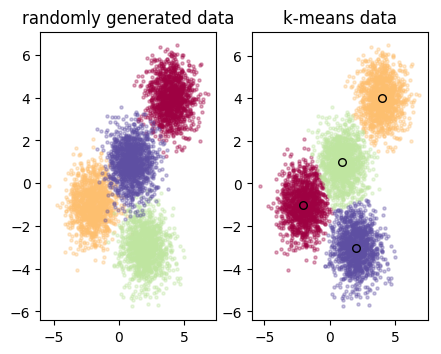
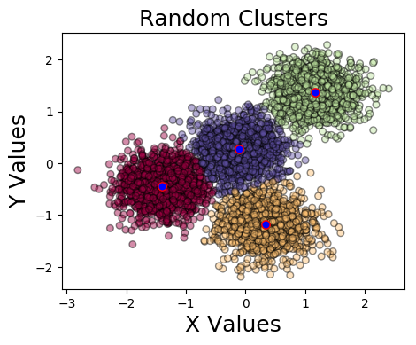
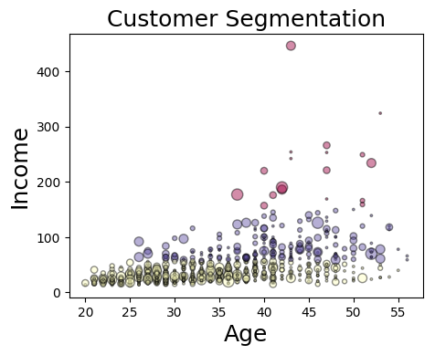

# K-means clustering program	
A set of functions for doing machine learning regression using sklearn, numpy,
and pandas packages. Uses k-means testing to group data and find centroid. This
work was done while completing IBM machine learning cert on Edx.

## Instructions
* Function can be used to return plot of clustered data as well as data grouped
  by k-means testing
  
  
  
  
  
  

## To Do
* Temporarily needed to insert a fix to manually assign colors in original data
  to match the order used in output. This should be fixed to handle general 
  data sets.
